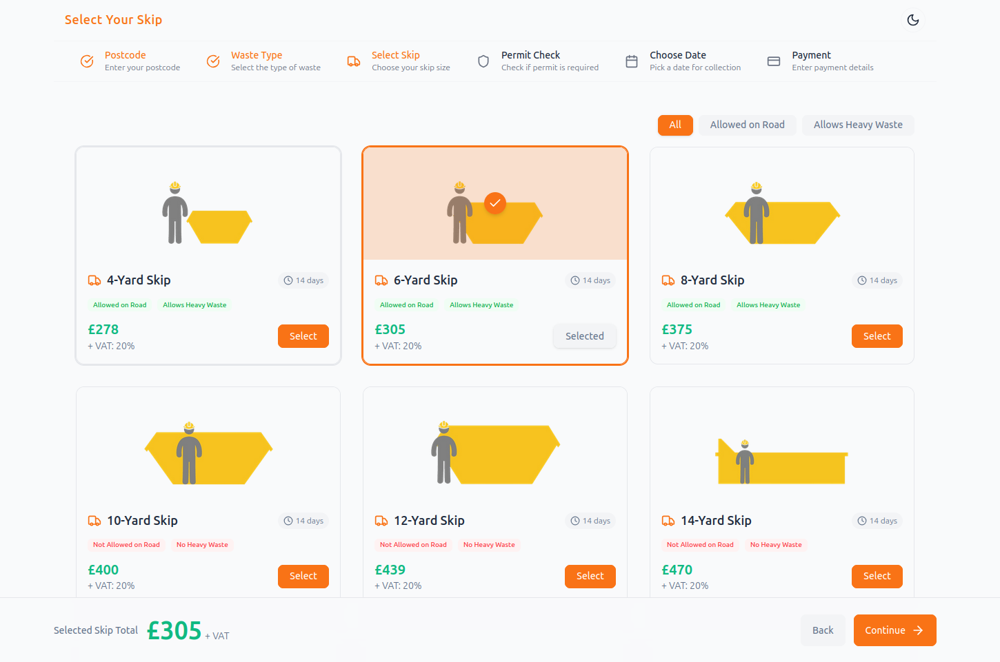
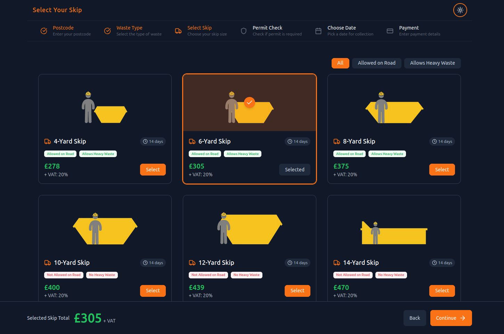
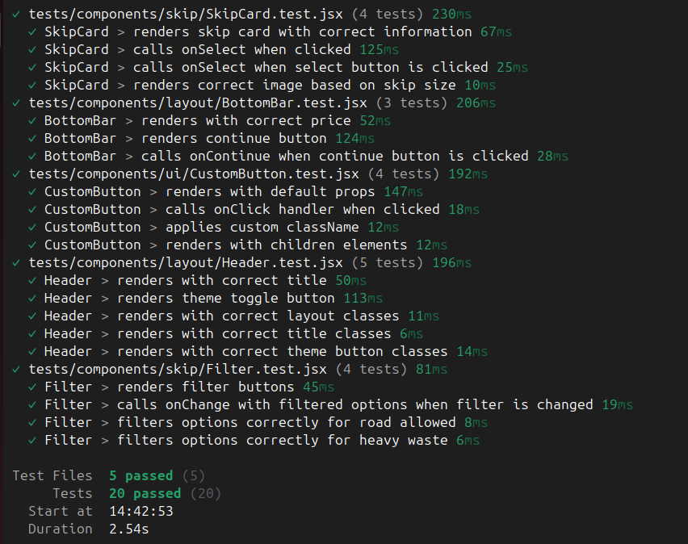

# RemWaste - Skip Hire Application

A modern web application for skip hire services, built with React and Vite.

## 🔗 Live Demo

- [View Live Demo](https://rem-waste-eta.vercel.app/skip)
- [Open in CodeSandbox](https://codesandbox.io/p/github/GPalhares/rem-waste/main?import=true)




## 🚀 Features

- Modern and responsive UI with adaptive grid system
- Dark/Light theme support
- Skip size selection
- Interactive skip cards
- Filter options for skip types
- Multi-step booking process

## 🤖 AI-Assisted Development

This project was developed with the assistance of Cursor AI, a powerful AI coding assistant that helped with:

- Code optimization and refactoring
- Implementation of best practices
- Test coverage and quality assurance
- Component architecture and organization
- Theme system implementation
- Responsive design patterns

The use of AI assistance helped ensure high code quality, maintainable architecture, and efficient development practices throughout the project.

### 📱 Responsive Design

The application uses a responsive grid system that adapts to different screen sizes:

- **Mobile (< 640px)**: Single column layout with full-width cards
- **Tablet (640px - 1024px)**: Two-column grid layout
- **Desktop (> 1024px)**: Three-column grid layout with optimized spacing

The grid system ensures optimal viewing experience across all devices while maintaining consistent spacing and alignment.

## 🛠️ Technologies

- [React](https://reactjs.org/)
- [Vite](https://vitejs.dev/)
- [Tailwind CSS](https://tailwindcss.com/)
- [React Router](https://reactrouter.com/)
- [Vitest](https://vitest.dev/) for testing
- [Testing Library](https://testing-library.com/) for component testing

## 📦 Project Structure

```
rem-waste/
├── src/
│   ├── components/
│   │   ├── layout/          # Layout components
│   │   │   ├── Header.jsx
│   │   │   ├── Layout.jsx
│   │   │   └── BottomBar.jsx
│   │   ├── ui/             # Reusable UI components
│   │   │   ├── CustomButton.jsx
│   │   │   ├── Loading.jsx
│   │   │   └── Stepper.jsx
│   │   └── skip/           # Skip-related components
│   │       ├── SkipCard.jsx
│   │       ├── Filter.jsx
│   │       └── Tags.jsx
│   ├── pages/              # Page components
│   │   ├── Skip.jsx
│   │   └── NotFound.jsx
│   ├── hooks/              # Custom React hooks
│   │   └── useTheme.js
│   ├── tests/              # Test setup and utilities
│   │   └── setup.js
│   ├── App.jsx
│   └── main.jsx
├── public/                 # Static assets
│   └── images/
├── tests/                  # Test files
│   └── components/
├── index.html
├── package.json
└── README.md
```

## 🚀 Getting Started

1. Clone the repository:

```bash
git clone git@github.com:GPalhares/rem-waste.git
cd rem-waste
```

2. Install dependencies:

```bash
npm install
```

3. Start the development server:

```bash
npm run dev
```

4. Open [http://localhost:5173](http://localhost:5173) in your browser.

## 🧪 Testing



The project includes comprehensive test coverage for all components using Vitest and React Testing Library.

Run tests:

```bash
npx vitest
```

## 🎨 Theme Customization

The application uses CSS variables for theming. You can customize the theme by modifying the variables in `src/index.css`:

```css
:root {
  --color-background: #f9fafb;
  --color-foreground: #1e293b;
  --color-primary: #f97316;
  --color-secondary: #64748b;
  --color-accent: #10b981;
  --color-muted: #f3f4f6;
  --color-border: #e5e7eb;
}

.dark {
  --color-background: #111827;
  --color-foreground: #f9fafb;
  --color-primary: #f97316;
  --color-secondary: #cbd5e1;
  --color-accent: #22c55e;
  --color-muted: #1e293b;
  --color-border: #334155;
}
```
